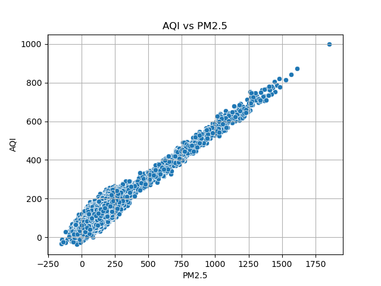
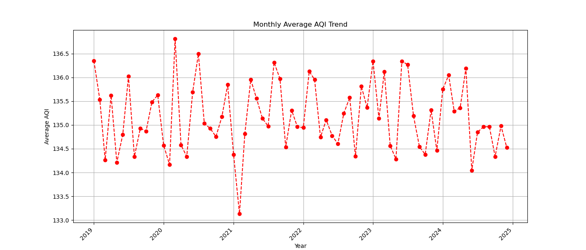
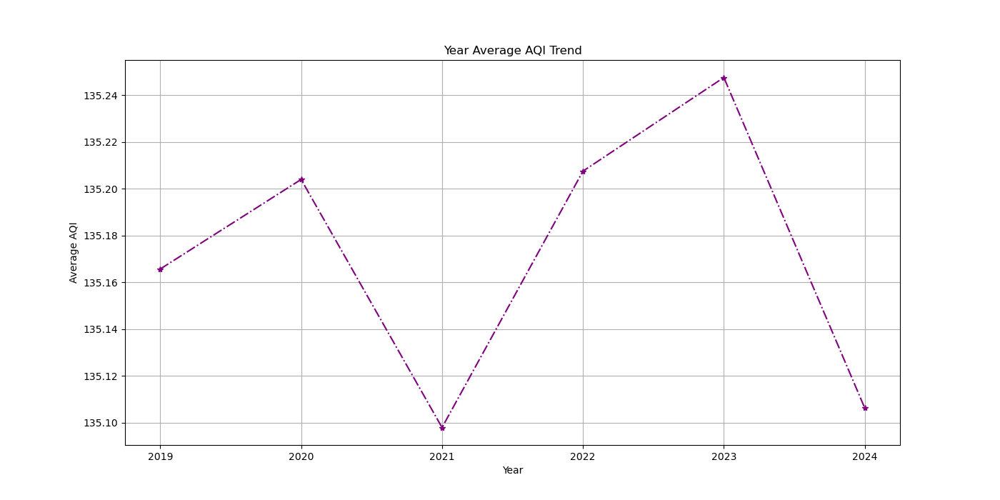
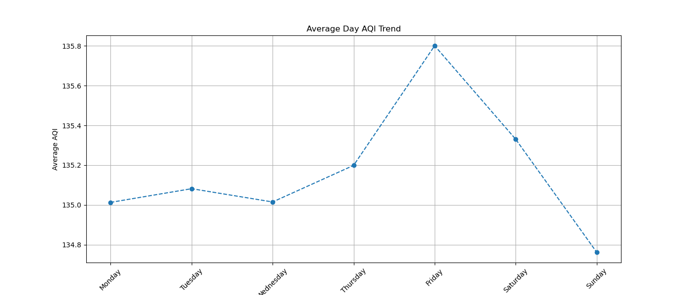

# Dhaka Air Quality Analysis

##  Project Overview

Dhaka, the capital of Bangladesh, frequently ranks among the most polluted cities globally. This project analyzes Air Quality Index (AQI) data to identify pollution trends, seasonal patterns, and high-risk periods. By leveraging data visualization, this analysis aims to provide actionable insights into when pollution is most dangerous for citizens .

##  Key Objectives & Insights

This analysis answers several critical questions regarding Dhaka's air quality:

* 
**Seasonal Trends:** Identifying which months (e.g., Winter vs. Summer) have the highest average AQI .

* 
**Yearly Progress:** Determining if air quality is improving or worsening over time by line plot of yearly AQI.

* 
**Weekly Patterns:** Comparing pollution levels between weekdays and weekends .

* 
**Risk Assessment:** Categorizing days from "Good" to "Unhealthy" and calculating the frequency of dangerous periods .

* 
**Pollutant Correlation:** Analyzing the relationship between specific pollutants like PM2.5 and the overall AQI .

##  Tech Stack

* 
**NumPy & Pandas:** Data cleaning and manipulation (grouping by month, year, and weekday).

* 
**Matplotlib & Seaborn:** Creating visualizations including line plots, bar charts, rolling averages.

##  Visualizations Included

1. 
**AQI Over Time:** A line plot showing the long-term trend and 7-day rolling average to smooth fluctuations.

2. 
**Monthly Distribution:** Line charts comparing the average AQI per month to highlight seasonal spikes.

3. 
**Weekday Analysis:** Comparison of pollution levels across different days of the week .

4. 
**Relation between one pollutant with whole AQI:** Visualizing how AQI reacts in increase of PM2.5 by scatterplot.

## Analysis & Results - 

1.**Monthly AQI Analysis:** Between year 2019 to 2025 most polluted month is in March on 2020 with highest average AQI 136.811 and monthly average AQI line chart is given in file Monthly_Average_AQI_Trend.png
  
  

2.**Seasonal AQI Trend:** By analyzing data we find out that on average Autumn,Monsoon,Winter and Summer have respectively 134.931652,135.164425,135.188024
and 135.260256 AQI.Again on average, in Summer, City is more polluted than Winter.

3.**Yearly AQI Trend:** On average highest AQI is 135.2476078335807 which occurs in year 2023 which also defines the plot in file Yearly_Average_AQI_Trend.png
  
  

4.**Weekdays** often be more polluted with 135.22180225947824 AQI.

5.**Daywise Analysis:** Friday is often be more polluted with 135.80102566753692 AQI.

  

6.**Correlation between AQI and Pollutants :**
| Pollutant | Correlation with AQI |
| :--- | :--- |
| **PM2.5** | **0.866246** |
| **PM10** | **0.497104** |
| **NO2** | **0.032790** |
| **SO2** | **0.010638** |
| **CO** | **0.001329** |

  This refers PM2.5 has the highest corelation meaning it conntribute most to the value of AQI.

7. Scatter plot of PM2.5 and AQI is almost an increasing straight line which refers AQI rises with rising of PM2.5

8.**High Risk Days Detection :** Total Unhealthy AQI days per year
  
| Year | Unhealthy Days |
| :--- | :--- |
| 2019 | 37 |
| 2020 | 34 |
| 2021 | 42 |
| 2022 | 37 |
| 2023 | 45 |
| 2024 | 36 |

  Year 2023 has most Unhealthy days.
Again,32.95% percent of days are dangerous among this years.

